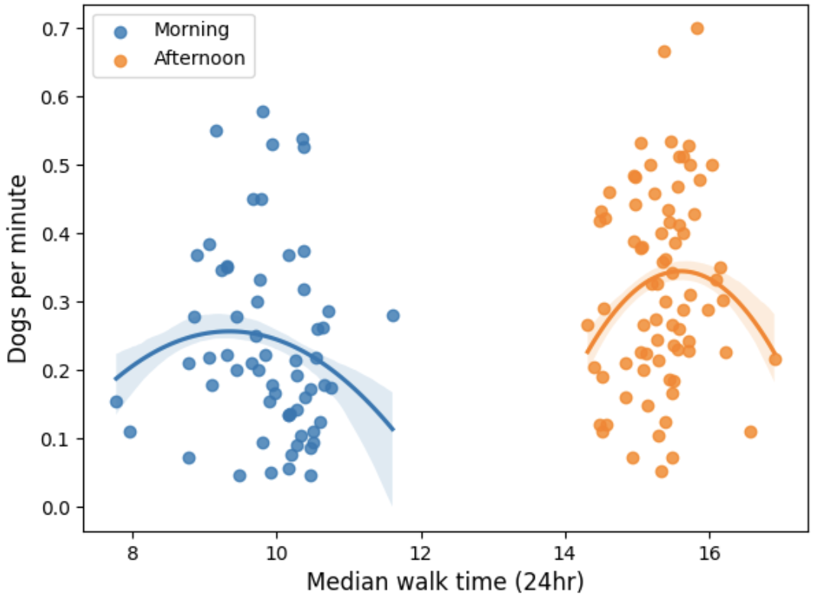

# Finding the optimal walking time for a reactive dog (and for fun) 

Requirements:
- pandas
- matplotlib
- seaborn

Walking stats including number of dogs encountered are recorded by hand in [dogs.csv](dogs.csv). 

All analysis and plots are handled in the accompanying [notebook](DogPlots.ipynb)

